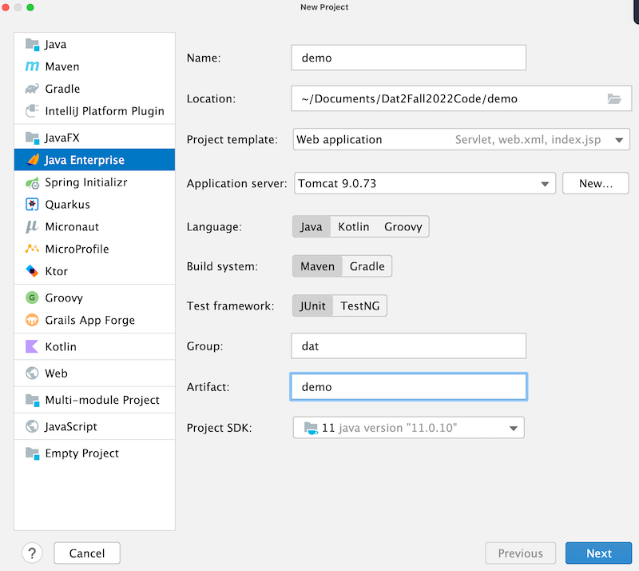
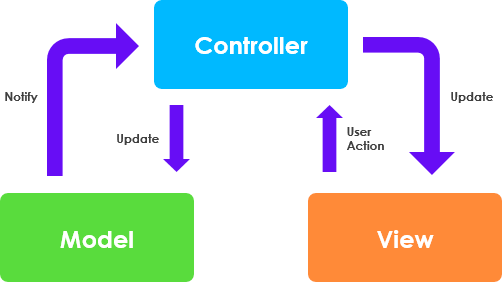

# Dokumentation
Dette er min egen dokumentation af Java Webstack. Vi skal lave et intranet og vil bruge dette dokumentation
til at bedre kunne huske hvad vi lavede.

## Start af et nyt webprojekt

1. Opret nyt projekt i IntelliJ
2. Vælg JavaEE projektskabelon
3. Java + Maven
4. Servlet dependencies



## Arkitektur

Vi anvender en slags MVC-pattern. 



- M(odel) - Entiteter og hjælpemetoder
- V(iew) - JSP og frontend (css, bootstrap mm)
- C(ontrol) - Servlets

Husk! Ingen kommunikation mellem Model og View. Gå altid igennem controlleren.

## Opret GIT repo
``````
git init
git add .
git commit -m "fist commit"
git remote add origin git@github.com:jonbertelsen/intranet.git
git push -u origin main
``````